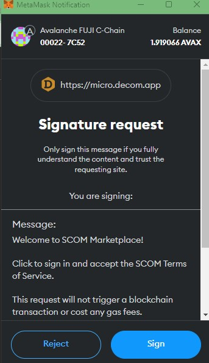
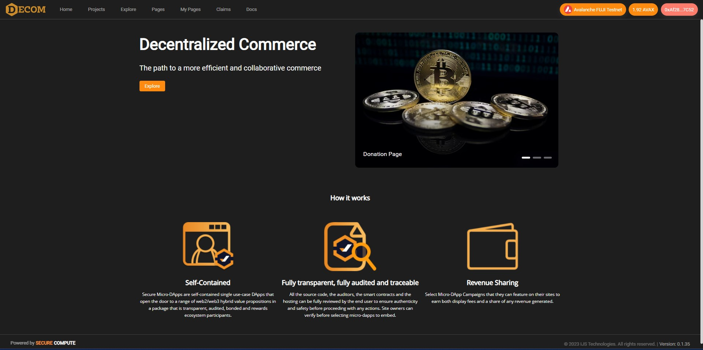

# Login

1. Before you login, a crypto wallet (i.e. Metamask or any wallet connected to Wallet Connect) is required.  If you do not have one, create one on
   [Metamask](https://www.metamask.io) or 
   [Wallet Connect](https://walletconnect.com/)

2. At the top right corner, click `Login`
   

4. Select whether you are connected with Metamask or Wallet Connect
   

6. Sign at the wallet to conenct the site and the wallet
   

8. Once the wallet and the site connected, the wallet address will be shown on the top-right corner
     
